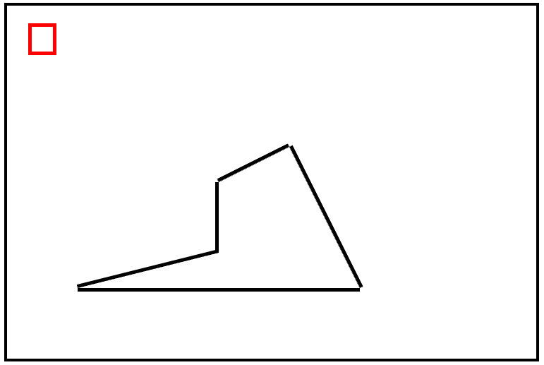

# Rust WebGL WASM Line Plotter

A sample project currently in development for learning how to use rust and WebGL together



This image was rendered in the browser with the following `draw_line` calls

```
    canvas.draw_line(300.0, 250.0, 400.0, 200.0, "black");
    canvas.draw_line(400.0, 200.0, 500.0, 400.0, "black");
    canvas.draw_line(500.0, 400.0, 100.0, 400.0, "black");
    canvas.draw_line(100.0, 400.0, 300.0, 350.0, "black");
    canvas.draw_line(300.0, 350.0, 300.0, 250.0, "black");

    canvas.draw_line(30.0, 30.0, 70.0, 30.0, "red");
    canvas.draw_line(30.0, 30.0, 30.0, 70.0, "red");
    canvas.draw_line(30.0, 70.0, 70.0, 70.0, "red");
    canvas.draw_line(70.0, 70.0, 70.0, 30.0, "red");
```

The numbers you see above are coordinates in the canvas by pixel location (x1, y1, x2, y2, ...)

You can build the example locally with:

```
$ npm run serve
```

and then visit http://localhost:8080 in a browser to run the example!

This project was inspired by the following resources
* [WebGL Fundamentals](https://webglfundamentals.org/)
* [Rust and WebAssembly WebGL Example](https://rustwasm.github.io/docs/wasm-bindgen/examples/webgl.html)